# Arquitectura y documentación técnica de Onboarding Formation

> **Documento maestro de producción**  
> **Fecha de corte:** 28 de julio de 2026  
> **Revisión del repositorio:** `main` en `8dad3c5`  
> **Repositorio:** `correoparaego/onboarding-formation`  
> **Estado:** fotografía verificable del código y del historial Git; no sustituye una auditoría legal o de seguridad independiente.

## Índice

1. [Propósito y alcance](#1-propósito-y-alcance)
2. [Contexto del producto](#2-contexto-del-producto)
3. [Especificación de features: OKF y Graphify](#3-especificación-de-features-okf-y-graphify)
4. [Arquitectura visual](#4-arquitectura-visual)
5. [Registro de decisiones de arquitectura](#5-registro-de-decisiones-de-arquitectura)
6. [Seguridad y protección de datos](#6-seguridad-y-protección-de-datos)
7. [Calidad de código y estrategia de testing](#7-calidad-de-código-y-estrategia-de-testing)
8. [IA y herramientas de ingeniería](#8-ia-y-herramientas-de-ingeniería)
9. [Despliegue en Render](#9-despliegue-en-render)
10. [Historial de ramas y pull requests](#10-historial-de-ramas-y-pull-requests)
11. [Riesgos, deuda y evolución](#11-riesgos-deuda-y-evolución)
12. [Anexos de trazabilidad](#12-anexos-de-trazabilidad)

---

## 1. Propósito y alcance

Este documento describe la arquitectura funcional y técnica de **Onboarding Formation**, una aplicación interna para administrar formación inicial obligatoria. La documentación sigue un enfoque de conocimiento abierto: cada capacidad se conecta con sus actores, reglas, entidades, componentes, dependencias, impacto empresarial, evidencia y estado real.

La fuente primaria es el código actual. Las especificaciones de `openspec/specs/`, el diseño archivado, los informes de verificación, Graphify, Git y GitHub se utilizan como evidencia secundaria. Cuando esas fuentes discrepan, prevalece el comportamiento observable en `main`.

### 1.1 Audiencia

| Audiencia | Necesidad cubierta |
|---|---|
| Dirección de producto | Entender el valor, alcance, restricciones y deuda del sistema. |
| Arquitectura e ingeniería | Reconstruir límites, dependencias, decisiones y evolución técnica. |
| Desarrollo frontend/backend | Localizar componentes, contratos, estados y flujos críticos. |
| QA | Identificar recorridos, puntos de decisión y cobertura disponible. |
| DevOps/SRE | Comprender build, arranque, Render, secretos, observabilidad y escalado. |
| Seguridad y cumplimiento | Revisar identidad, PII, cifrado, auditoría, retención y riesgos. |
| Mantenimiento futuro | Distinguir decisiones aceptadas de implementaciones accidentales o provisionales. |

### 1.2 Convenciones de estado

| Etiqueta | Significado |
|---|---|
| **Verificado** | Existe código y evidencia de prueba histórica explícita. |
| **Implementado** | Existe código actual, pero no una verificación integral reciente equivalente. |
| **Parcial** | El flujo existe, aunque faltan integraciones, UI, pruebas o condiciones relevantes. |
| **Deuda** | El comportamiento actual presenta una inconsistencia, riesgo o carencia conocida. |
| **Objetivo** | Recomendación futura; no describe el sistema actual. |
| **Pendiente de decisión** | Requiere validación de producto, arquitectura, seguridad o legal. |

### 1.3 Principios de interpretación

- Un test histórico prueba el estado del commit sobre el que se ejecutó, no necesariamente `HEAD`.
- Una casilla marcada en un PR no equivale a un check automatizado ni a una review independiente.
- La ausencia de una herramienta o configuración no se presenta como una decisión deliberada.
- El certificado es un documento interno imprimible, no una firma electrónica ni una acreditación cualificada.
- La lectura cronometrada aporta control razonable, no prueba de presencia humana.
- El sistema es **single-tenant**: no existe aislamiento de datos entre empresas.

---

## 2. Contexto del producto

### 2.1 Problema empresarial

La formación inicial obligatoria suele combinar altas manuales, hojas de cálculo, contenidos dispersos, seguimiento por correo y evidencia documental difícil de reconstruir. El sistema centraliza ese ciclo y busca responder preguntas operativas y de cumplimiento:

- ¿Qué cursos corresponden a cada puesto?
- ¿Qué versión concreta recibió cada empleado?
- ¿Qué contenido se desbloqueó y cuánto tiempo se acreditó?
- ¿Cuántos intentos de evaluación se utilizaron?
- ¿Quién aprobó, cuándo y con qué puntuación?
- ¿Qué certificado, expediente y eventos de auditoría existen?

### 2.2 Propuesta de valor

```text
Empleado importado
  → puesto normalizado
  → catálogo obligatorio
  → matrícula fijada a una versión
  → acceso temporal de un solo uso
  → lectura secuencial controlada por servidor
  → test de comprensión
  → expediente + badges + certificado
  → auditoría transversal
```

El valor principal no es la reproducción de PDFs, sino la **orquestación trazable del cumplimiento formativo**. `reading_gate` constituye el centro de gravedad del dominio porque coordina matrícula, progreso, evaluación, resultado y evidencias.

### 2.3 Actores

| Actor | Responsabilidades | Límite de confianza |
|---|---|---|
| Administrador | Importa empleados, gestiona cursos/versiones, asigna formación, emite accesos, configura IA y consulta resultados. | Usuario Django autenticado con privilegios amplios. No existe RBAC administrativo granular. |
| Empleado | Canjea un token/código, consume contenido, genera heartbeats y realiza el test. | Identidad vinculada a posesión del acceso; no existe MFA ni verificación fuerte. |
| Proveedor de correo | Entrega enlaces, códigos y comunicaciones de finalización. | Integración externa mediante consola, SMTP o Resend. |
| Proveedor LLM | Genera borradores de contenido o preguntas. | Recibe material de curso sanitizado; no debe recibir registros de empleados. |
| Render | Construye y ejecuta el contenedor web. | Aloja aplicación y variables del entorno de producción. |
| PostgreSQL/S3 | Persisten datos relacionales y PDFs privados. | Deben desplegarse y protegerse según la política de residencia y retención. |

### 2.4 Objetivos y métricas de negocio

| Objetivo | Capacidad habilitadora | Métrica sugerida |
|---|---|---|
| Reducir trabajo manual de RR. HH./PRL | Importación, catálogo por puesto y asignación masiva | Tiempo desde alta hasta matrícula emitida. |
| Reducir omisiones formativas | Asignación automática y vista previa | Empleados sin cursos obligatorios asignados. |
| Preservar evidencia histórica | Versionado, expediente, certificado y auditoría | Matrículas con versión, resultado y trazabilidad completos. |
| Mejorar la finalización | Portal, reanudación, notificaciones y accesos masivos | Tasa de inicio, finalización y aprobación por cohorte. |
| Reducir coste de autoría | Generación IA con revisión humana | Tiempo de creación de curso/test y tasa de borradores aceptados. |
| Limitar exposición de PII | Cifrado, HMAC, rutas privadas y saneamiento | Incidentes, accesos denegados y secretos/PII detectados en logs. |

Las métricas son propuestas. El código no implementa actualmente una plataforma de métricas de negocio ni SLO.

### 2.5 Stack tecnológico

| Capa | Tecnología | Responsabilidad |
|---|---|---|
| Frontend | React 18, TypeScript, Vite 5 | SPA administrativa y portal del empleado. |
| Navegación | React Router 6 | Separación de rutas públicas, administrativas y de empleado. |
| Formularios | React Hook Form + Zod | Captura y validación de formularios administrativos. |
| HTTP | Axios | API JSON, cookies de sesión y cabecera XSRF. |
| PDF cliente | `react-pdf` / PDF.js | Visualización controlada del material. |
| Backend | Django + Django ORM | API, sesiones, reglas de dominio y persistencia. |
| API | Vistas Django y `JsonResponse` | Contratos HTTP; DRF está instalado pero no domina la implementación. |
| Datos | PostgreSQL; SQLite local | Persistencia relacional. |
| Archivos | Django Storage; S3 opcional | PDFs privados por sección. |
| Certificados | ReportLab | Generación de PDF imprimible. |
| Importación | pandas + openpyxl | Lectura y validación de Excel. |
| E2E | Playwright | Recorridos de navegador; la suite mezcla specs opt-in con diagnósticos que apuntan a Render por defecto. |
| Producción | Docker, Nginx y Gunicorn | Build, proxy, estáticos y servidor WSGI en Render. |

---

## 3. Especificación de features: OKF y Graphify

### 3.1 Modelo Entidad-Relación-Impacto

El enfoque Graphify utilizado en esta sección conecta cuatro clases de nodos:

| Tipo de nodo | Pregunta respondida | Ejemplo |
|---|---|---|
| Entidad | ¿Qué concepto persistente gobierna la capacidad? | `Enrollment`, `CourseVersion`, `AuditEvent`. |
| Relación | ¿Qué dependencia o regla conecta los conceptos? | Una matrícula queda fijada a una versión. |
| Componente | ¿Qué código implementa la regla? | `reading_gate/services.py`. |
| Impacto | ¿Por qué existe para el negocio? | Preservar el contenido histórico cursado. |

### 3.2 Grafo de capacidades

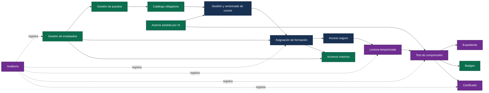

### 3.3 Catálogo detallado de features

#### F-01. Autenticación administrativa y aislamiento de roles

| Atributo | Detalle |
|---|---|
| Descripción funcional | Permite login/logout administrativo mediante credenciales Django y crea una sesión de servidor. Un middleware separa rutas administrativas y de empleado. |
| Actores | Administrador, empleado no autorizado. |
| Entidades | `django.contrib.auth.User`, sesión Django. |
| Componentes backend | `backend/authentication/views.py`, `middleware.py`, `urls.py`. |
| Componentes frontend | `frontend/src/auth/AuthContext.tsx`, `AdminLogin.tsx`, `ProtectedRoute.tsx`. |
| Dependencias | Cookies, CSRF, CORS, middleware de sesiones y autenticación Django. |
| Impacto empresarial | Evita que operaciones de alta, contenido, asignación o expediente queden expuestas al portal del empleado. |
| Decisión técnica | Sesión Django, no JWT; autorización efectiva por prefijos y comprobaciones de vista. |
| Estado | **Implementado con deuda**. La política global DRF es `AllowAny` y una ruta futura no incluida en los prefijos puede quedar abierta. |

#### F-02. Acceso temporal del empleado

| Atributo | Detalle |
|---|---|
| Descripción funcional | Emite un token largo y un código manual de un solo uso con caducidad. Al canjearlo, se marca como consumido y se vincula `employee_id` a la sesión. |
| Actores | Administrador emisor, empleado receptor. |
| Entidades | `EmployeeAccessToken`, `Employee`, opcionalmente `Enrollment`. |
| Componentes backend | `backend/authentication/models.py`, `views.py`; `backend/notifications/services.py`, `templates.py`. |
| Componentes frontend | `frontend/src/auth/EmployeeRedeem.tsx`, `ProtectedRoute.tsx`. |
| Dependencias | Generador criptográfico `secrets`, SHA-256, email, sesiones. |
| Impacto empresarial | Elimina la gestión de contraseñas de empleados y reduce fricción en campañas de incorporación. |
| Decisión técnica | Se almacena únicamente el hash del secreto; TTL configurable, 24 horas por defecto. |
| Estado | **Parcial/deuda**. El enlace enviado usa `/acceso?token=...`, pero la SPA expone `/employee/redeem` y no consume ese query parameter. La redención tampoco es atómica. |

#### F-03. Importación y protección de empleados

| Atributo | Detalle |
|---|---|
| Descripción funcional | Importa empleados desde Excel, valida filas, conserva el DNI verbatim, deduplica y reconcilia el puesto. |
| Actores | Administrador, empleado importado. |
| Entidades | `Employee`, `Position`. |
| Componentes backend | `backend/employees/models.py`, `views.py`; `backend/common/crypto.py`, `fields.py`, `parsing.py`. |
| Componentes frontend | `frontend/src/admin/EmployeeImport.tsx`. |
| Dependencias | pandas, openpyxl, AES-GCM, HMAC-SHA256. |
| Impacto empresarial | Sustituye altas manuales, reduce duplicados y conecta datos corporativos con obligaciones formativas. |
| Decisión técnica | DNI cifrado con nonce aleatorio; lookup independiente determinista mediante HMAC. |
| Estado | **Verificado en el MVP**. La respuesta de importación puede incluir DNI y requiere tratamiento como dato sensible. |

#### F-04. Puestos y catálogo obligatorio

| Atributo | Detalle |
|---|---|
| Descripción funcional | Mantiene puestos normalizados, asignación individual/masiva y relación N:M entre puestos y cursos requeridos. |
| Actores | Administrador. |
| Entidades | `Position`, `Employee.current_position`, `Course.positions`. |
| Componentes backend | `backend/courses/models.py`; `backend/employees/views.py`. |
| Componentes frontend | `frontend/src/admin/AssignmentManagement.tsx`. |
| Dependencias | Gestión de empleados y cursos. |
| Impacto empresarial | Formaliza qué formación corresponde a cada función y permite operar cambios organizativos. |
| Decisión técnica | Se conserva el texto de puesto importado y se añade una referencia normalizada separada. |
| Estado | **Implementado después del MVP**. Cambiar `current_position` no reconcilia automáticamente todas las matrículas; la acción posterior debe ser explícita. |

#### F-05. Gestión y versionado de cursos

| Atributo | Detalle |
|---|---|
| Descripción funcional | Crea cursos, versiones draft/published/archived, secciones ordenadas, bancos de preguntas y publicación de una versión activa. |
| Actores | Administrador, empleado consumidor. |
| Entidades | `Course`, `CourseVersion`, `Section`, `QuestionBank`, `Question`. |
| Componentes backend | `backend/courses/models.py`, `services.py`, `views.py`, `urls.py`. |
| Componentes frontend | `frontend/src/admin/CourseManagement.tsx`. |
| Dependencias | Storage de PDF, catálogo de puestos, evaluación. |
| Impacto empresarial | Permite actualizar contenido sin alterar la evidencia de formaciones ya asignadas. |
| Decisión técnica | La identidad estable es `Course`; el contenido publicable vive en `CourseVersion`; la matrícula referencia la versión. |
| Estado | **Implementado**, con pruebas focalizadas en PRs posteriores; no existe spec OpenSpec activa equivalente al cambio completo. |

#### F-06. PDFs privados por sección

| Atributo | Detalle |
|---|---|
| Descripción funcional | Valida firma y tamaño del PDF, lo asocia a una sección y lo entrega solo mediante rutas autenticadas si pertenece a la matrícula y está desbloqueado. |
| Actores | Administrador autor, empleado matriculado. |
| Entidades | `Section`, `Enrollment`, `ReadingProgress`. |
| Componentes backend | `backend/courses/views.py`; `backend/reading_gate/views.py`; configuración `STORAGES`. |
| Componentes frontend | Editor de cursos y `frontend/src/components/PdfReader/index.tsx`. |
| Dependencias | Django Storage, S3 opcional, autorización de empleado. |
| Impacto empresarial | Limita distribución no controlada y mantiene el contenido dentro del recorrido acreditable. |
| Decisión técnica | No se expone `/media/`; las vistas autorizadas abren el archivo mediante Django Storage y lo transmiten con `FileResponse`. La configuración S3 admite query strings firmadas de cinco minutos, pero las rutas actuales no entregan esas URLs al cliente. |
| Estado | **Implementado**. El filesystem local es solo fallback; en Render no garantiza persistencia entre despliegues. |

#### F-07. Asignación y ciclo de matrícula

| Atributo | Detalle |
|---|---|
| Descripción funcional | Asigna automáticamente cursos obligatorios, permite vista previa/aplicación manual y gestiona pausa, reanudación, cancelación y repetición por ciclos. |
| Actores | Administrador, empleado destinatario. |
| Entidades | `Enrollment`, `Employee`, `Course`, `CourseVersion`, `Position`. |
| Componentes backend | `backend/reading_gate/services.py`, `views.py`, `urls.py`. |
| Componentes frontend | `frontend/src/admin/AssignmentManagement.tsx`. |
| Dependencias | Empleados, puestos, versión activa, notificaciones. |
| Impacto empresarial | Reduce omisiones y preserva histórico ante cambios, interrupciones o recertificación. |
| Decisión técnica | Unicidad por empleado, curso y ciclo; repetición crea un ciclo nuevo, no borra el anterior. |
| Estado | Asignación automática **verificada**; ciclo ampliado **implementado** después del informe MVP. |

#### F-08. Lectura temporizada y secuencial

| Atributo | Detalle |
|---|---|
| Descripción funcional | El navegador emite heartbeat cada cinco segundos; el backend acredita tiempo si la pestaña está visible y hubo interacción reciente, limita deltas y desbloquea secciones secuencialmente. |
| Actores | Empleado. |
| Entidades | `Enrollment`, `Section`, `ReadingProgress`, `AuditEvent`. |
| Componentes backend | `backend/reading_gate/services.py`, `views.py`. |
| Componentes frontend | `frontend/src/components/PdfReader/index.tsx`, `EmployeeApp.tsx`. |
| Dependencias | PDFs privados, sesión de empleado, reloj servidor, auditoría. |
| Impacto empresarial | Aporta evidencia razonable de exposición al contenido y dificulta saltarse el orden desde el cliente. |
| Decisión técnica | Autoridad en servidor; tiempo mínimo derivado de `section_base`; delta máximo de 120 segundos. |
| Estado | **Verificado en backend** y conectado a UI. No prueba identidad ni presencia humana. |

#### F-09. Test de comprensión

| Atributo | Detalle |
|---|---|
| Descripción funcional | Desbloquea preguntas tras completar lectura, selecciona hasta cinco de forma determinista, corrige en servidor y limita intentos. |
| Actores | Empleado, administrador autor del banco. |
| Entidades | `QuestionBank`, `Question`, `Enrollment`, `Expediente`, `AuditEvent`. |
| Componentes backend | `backend/reading_gate/services.py`, `views.py`. |
| Componentes frontend | Flujo de test en `frontend/src/employee/EmployeeApp.tsx`. |
| Dependencias | Lectura completa, banco publicado, badges, notificaciones y certificado. |
| Impacto empresarial | Aporta evidencia de comprensión además de tiempo de lectura. |
| Decisión técnica | Subset determinista y umbral actual del 100 %; un fallo reinicia el progreso de lectura. |
| Estado | **Implementado con defecto**. El tercer fallo puede dejar la matrícula bloqueada en `in_progress`; `failed_exhausted` requiere una entrega adicional que la UI normal ya no permite. |

#### F-10. Expediente de formación

| Atributo | Detalle |
|---|---|
| Descripción funcional | Consolida resultado, puntuación, intentos y estado por matrícula, con filtros administrativos. |
| Actores | Administrador. |
| Entidades | `Expediente`, `Enrollment`, `Employee`, `Course`. |
| Componentes backend | `backend/reading_gate/models.py`, `views.py`. |
| Componentes frontend | `frontend/src/admin/ExpedienteList.tsx`. |
| Dependencias | Evaluación y autorización administrativa. |
| Impacto empresarial | Proporciona una vista operativa de cumplimiento y una fuente para informes. |
| Decisión técnica | Relación uno-a-uno con matrícula; escritura al aprobar o agotar intentos. |
| Estado | **Verificado en backend con deuda frontend**: los filtros ofrecen estados que no coinciden con el modelo actual. |

#### F-11. Certificados y badges

| Atributo | Detalle |
|---|---|
| Descripción funcional | Genera un certificado PDF tras aprobar y concede badges por primer curso, catálogo completo o aprobación sin fallos. |
| Actores | Empleado beneficiario, administrador descargador. |
| Entidades | `Certificate`, `Badge`, `EmployeeBadge`, `Enrollment`, `Expediente`. |
| Componentes backend | `backend/certificates/models.py`, `services.py`, `views.py`. |
| Componentes frontend | No existe una experiencia completa específica; consumo principalmente vía API/administración. |
| Dependencias | Estado `passed`, ReportLab, historial de curso, auditoría. |
| Impacto empresarial | Entrega evidencia imprimible y reconocimiento básico. |
| Decisión técnica | Un certificado por matrícula; sin firma electrónica. |
| Estado | **Verificado con deuda histórica**. Parte del contenido se reconstruye desde el `Course` actual y no exclusivamente desde `Enrollment.course_version`. |

#### F-12. Auditoría transversal

| Atributo | Detalle |
|---|---|
| Descripción funcional | Registra eventos de importación, asignación, lectura, intentos y certificados; API y Django Admin son de solo lectura. |
| Actores | Administrador/auditor, servicios internos. |
| Entidades | `AuditEvent`, `Enrollment`. |
| Componentes backend | `backend/reading_gate/models.py`, `admin.py`, `views.py`, `tests_audit.py`. |
| Dependencias | Todas las capacidades de cumplimiento. |
| Impacto empresarial | Permite reconstruir el recorrido entre dispositivos y defender la coherencia del expediente. |
| Decisión técnica | Append-only a nivel de API/admin, payload sin DNI o tokens en claro. |
| Estado | **Verificado**, pero no es WORM: ORM/SQL privilegiado puede modificarlo y `CASCADE` elimina eventos al borrar una matrícula. |

#### F-13. Notificaciones y accesos masivos

| Atributo | Detalle |
|---|---|
| Descripción funcional | Envía comunicaciones de acceso/finalización mediante consola, SMTP o Resend; permite generar códigos para lotes de hasta 100 empleados. |
| Actores | Administrador, empleado, proveedor de correo. |
| Entidades | `NotificationLog`, `EmployeeAccessToken`, `Employee`. |
| Componentes backend | `backend/notifications/services.py`, `views.py`, `transports.py`, `templates.py`. |
| Componentes frontend | Sección de accesos en `AssignmentManagement.tsx`. |
| Dependencias | Autenticación de empleado, email, rate limit. |
| Impacto empresarial | Reduce tareas repetitivas y acelera campañas de onboarding. |
| Decisión técnica | Transporte seleccionable por variable de entorno; respuesta de lotes marcada `no-store`. |
| Estado | Transporte local **verificado**; proveedores reales **no verificados integralmente**. El magic link generado está roto en la ruta actual. |

#### F-14. Autoría asistida por IA

| Atributo | Detalle |
|---|---|
| Descripción funcional | Genera borradores de secciones a partir de respuestas y preguntas desde PDFs; requiere revisión y guardado explícito. |
| Actores | Administrador, proveedor LLM. |
| Entidades | `AdminLLMKey`, borradores no persistentes, `CourseVersion`, `QuestionBank`. |
| Componentes backend | `backend/ai_generation/client.py`, `models.py`, `prompts.py`, `sanitizer.py`, `views.py`. |
| Componentes frontend | `frontend/src/admin/ai/GuidedContent.tsx`, `AIKeyForm.tsx`, `PdfTestGen.tsx`. |
| Dependencias | Cifrado común, proveedor compatible con OpenAI o Gemini, extracción PDF. |
| Impacto empresarial | Reduce el coste inicial de autoría manteniendo control humano sobre el contenido publicado. |
| Decisión técnica | Prioridad efectiva: fake LLM, BYO por administrador y Gemini global; llamadas síncronas. |
| Estado | **Parcial**. Fake y sanitización tienen pruebas; proveedor real no. El guardado guiado omite título/contenido de secciones y `PyPDF2` se usa sin figurar en `requirements.txt`. |

### 3.4 Dependencias entre módulos

| Módulo | Depende de | Razón |
|---|---|---|
| `employees` | `courses.Position`, `common` | Normalización del puesto y cifrado del DNI. |
| `courses` | Django Storage | Versiones, secciones, bancos y archivos privados. |
| `reading_gate` | `employees`, `courses`, `notifications`, `certificates` | Orquesta el ciclo de cumplimiento. |
| `notifications` | `authentication`, `employees`, `reading_gate` | Emite credenciales y comunica transiciones. |
| `certificates` | `employees`, `courses`, `reading_gate` | Construye artefactos desde identidad y resultado. |
| `ai_generation` | `common`, `courses` indirectamente | Protege credenciales y produce borradores para persistencia posterior. |
| Frontend administrativo | Todas las APIs administrativas | Administración operativa. |
| Frontend empleado | Auth, matrículas, lectura y test | Recorrido de formación. |

### 3.5 Matriz de trazabilidad feature-especificación-prueba

| Feature | Spec activa | Implementación principal | Evidencia de prueba | Estado documental |
|---|---|---|---|---|
| Autenticación | `openspec/specs/authentication/spec.md` | `backend/authentication/` | Informe MVP | Alineada parcialmente. |
| Acceso seguro | `secure-access/spec.md` | `authentication`, `notifications` | Tests de notificaciones | Magic link actual no reflejado. |
| Importación | `employee-import/spec.md` | `employees` | Tests de importación/cifrado | Alineada. |
| Cursos | `course-management/spec.md` | `courses` | Tests de cursos | Spec anterior al versionado. |
| Asignación | `enrollment-assignment/spec.md` | `reading_gate` | Tests de servicios/API | No cubre ciclos avanzados. |
| Lectura | `timed-reading/spec.md` | `reading_gate`, `PdfReader` | Tests backend | E2E completo pendiente. |
| Test | `comprehension-test/spec.md` | `reading_gate`, portal empleado | Tests backend | Defecto de tercer intento pendiente. |
| Expediente | `expediente/spec.md` | `reading_gate` | Tests backend | Estados UI desalineados. |
| Certificado | `certificate/spec.md` | `certificates` | Tests PDF | Versionado histórico incompleto. |
| Badges | `badges/spec.md` | `certificates` | Tests de servicios | Alineada parcialmente. |
| Auditoría | `audit-log/spec.md` | `reading_gate` | Tests append-only | Sin inmutabilidad DB. |
| Notificaciones | `notifications/spec.md` | `notifications` | Transporte simulado | Externos pendientes. |
| IA | `ai-generation/spec.md` | `ai_generation` | Fake/sanitizador | Gemini global amplía el diseño. |
| Versionado/PDF/ciclos/acceso masivo | Sin specs activas dedicadas | Múltiples módulos | Tests focalizados posteriores | Debe actualizarse OpenSpec. |

### 3.6 Estado del conocimiento generado

- El informe archivado del 15 de julio declara **57/57 tareas** y **56 tests backend** aprobados para 13 capacidades.
- Cambios posteriores añadieron versionado, ciclo de matrícula, PDFs privados, puestos y accesos masivos.
- El grafo disponible fue construido desde `3b145d2`, 64 commits por detrás del corte actual, por lo que debe tratarse como fotografía histórica.
- Graphify registró 893 nodos, 1.446 relaciones y ningún ciclo de importación, pero incluyó artefactos `.vite`, lo que distorsiona centralidad y comunidades.
- El informe E2E del 22 de julio declara 2/2, aunque el recorrido empleado aceptó cero matrículas y no ejercitó lectura, test ni certificado.

---

## 4. Arquitectura visual

### 4.1 Arquitectura general del sistema

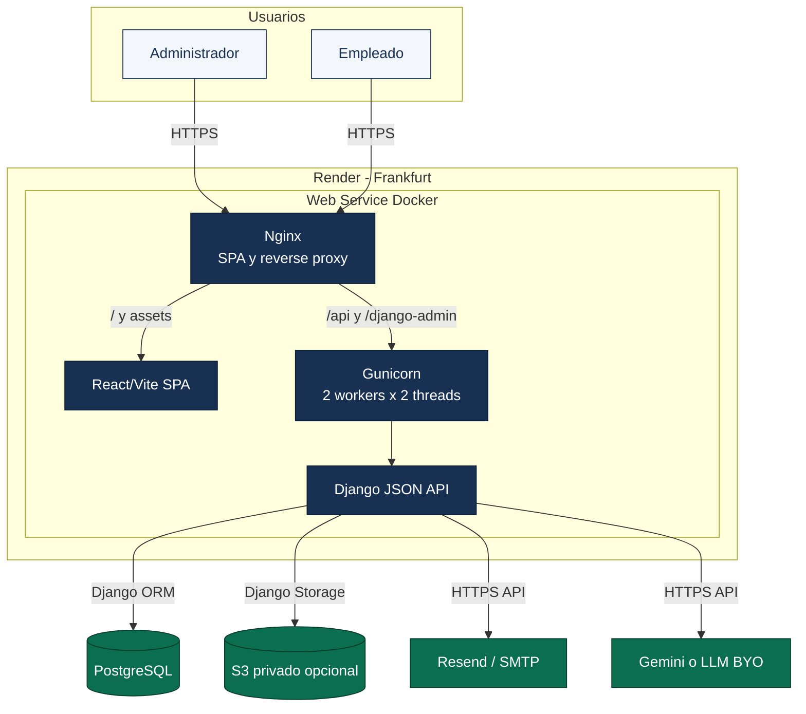

**Lectura:** aunque el diseño archivado describe dos unidades independientes, `render.yaml`, `Dockerfile`, `start.sh` y `nginx.conf` implementan actualmente una sola unidad Docker. La SPA y la API comparten origen y ciclo de despliegue.

### 4.2 Arquitectura del frontend

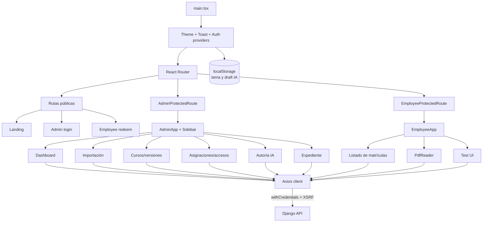

#### Gestión de estado

| Alcance | Mecanismo | Observación |
|---|---|---|
| Sesión y actor | `AuthContext` + cookie Django | La cookie es la autoridad; el contexto consulta `/status`. |
| Tema | `ThemeContext` + `localStorage` | Preferencia no sensible. |
| Notificaciones UI | `ToastContext` | Estado efímero. |
| Datos remotos | Axios + `useState`/`useEffect` | No existe React Query, Redux o Zustand. |
| Borrador IA | Estado local + `localStorage` | Debe evitarse persistir PII o secretos. |
| Lectura | Estado de componente + backend | El backend mantiene tiempo y desbloqueo autoritativos. |

La estrategia es apropiada para un MVP pequeño, pero carece de una capa uniforme de caché, invalidación, deduplicación y estados de servidor. Las pantallas implementan carga/error/reintento de forma independiente.

### 4.3 Arquitectura del backend

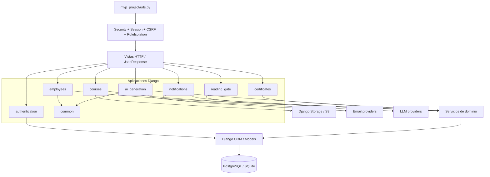

#### Capas efectivas

| Capa | Responsabilidad | Realidad del código |
|---|---|---|
| Enrutamiento | Mapear URL y método | URLConfs por app. |
| Middleware | Seguridad transversal y separación de roles | Autorización basada parcialmente en prefijos. |
| Vistas/controladores | Parsear petición, autorizar, serializar respuesta | Vistas Django; DRF tiene presencia limitada. |
| Servicios | Reglas multi-entidad y transacciones | Especialmente relevantes en `reading_gate`, `notifications`, `courses` y `certificates`. |
| Modelos/repositorios | Persistencia y restricciones | Django ORM actúa como modelo y repositorio. No existe capa repository explícita. |
| Integraciones | Email, storage, LLM, PDF | Adaptadores propios o librerías Django. |

### 4.4 Modelo de dominio

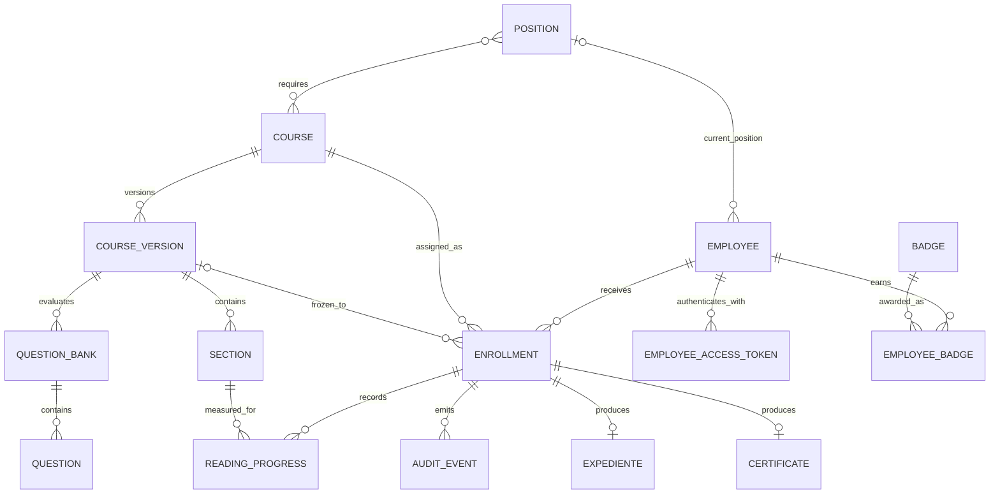

### 4.5 Estados de matrícula

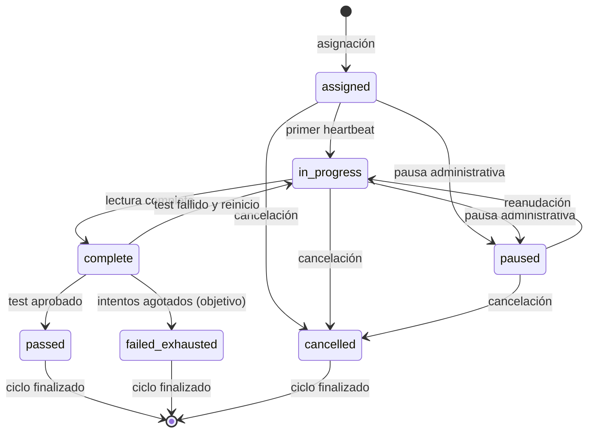

**Advertencia:** el estado objetivo del tercer fallo y la transición implementada no coinciden completamente. El flujo actual puede bloquear preguntas al alcanzar tres intentos sin persistir `failed_exhausted`. La repetición no reactiva la misma entidad: crea un `Enrollment` nuevo con un ciclo superior.

### 4.6 Flujo crítico 1: alta, asignación y acceso

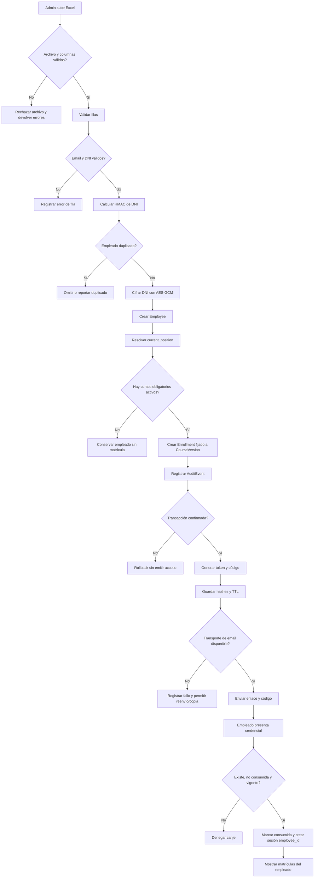

#### Reglas críticas del flujo

- La emisión se programa después del commit para evitar credenciales de matrículas revertidas.
- Solo se persisten hashes de token/código.
- El DNI cifrado y su HMAC resuelven objetivos distintos: confidencialidad y deduplicación.
- La ausencia de catálogo no debe impedir conservar el empleado importado, pero debe ser visible operativamente.
- El enlace actual debe corregirse antes de considerar completo el happy path por correo.

### 4.7 Flujo crítico 2: lectura, evaluación y evidencia

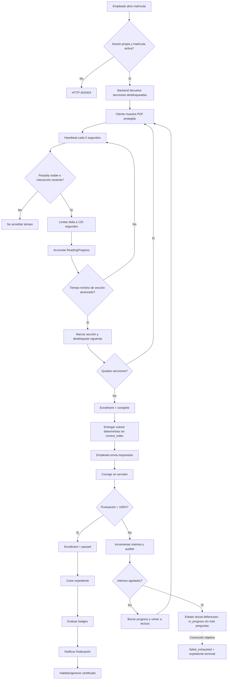

#### Garantías y límites

| Garantía | Implementación | Límite |
|---|---|---|
| Orden de lectura | Desbloqueo decidido por backend. | No demuestra comprensión. |
| Tiempo acreditado | Heartbeats validados y delta limitado. | No demuestra presencia humana continua. |
| Reanudación | Progreso persistido por matrícula/sección. | La semántica de dispositivo/sesión requiere observación operativa. |
| Corrección | Respuestas correctas nunca se envían en GET. | El banco debe tener calidad suficiente. |
| Reproducibilidad | Subset determinista por matrícula/intento. | El hash/semilla debe mantenerse estable entre versiones. |
| Evidencia | Expediente, certificado y auditoría. | Auditoría no es inmutable a nivel de base de datos. |

---

## 5. Registro de decisiones de arquitectura

### ADR-001. Mantener un dominio single-tenant

| Campo | Decisión |
|---|---|
| Estado | **Aceptada para MVP**. |
| Contexto | El producto inicial atiende una sola empresa. Introducir tenancy exige partición, autorización, migraciones, configuración y pruebas de aislamiento. |
| Alternativas | Multi-tenant con `tenant_id`; schema por tenant; instancia por empresa; single-tenant. |
| Decisión | No añadir `company` o `tenant_id`; operar una única organización por despliegue. |
| Por qué | Minimiza complejidad y acelera validación del núcleo de cumplimiento. |
| Consecuencias positivas | Modelos simples, consultas directas, menor superficie de autorización. |
| Consecuencias negativas | No puede alojar varias empresas con aislamiento garantizado; evolucionar requerirá migración transversal. |
| Evidencia | `openspec/.../design.md:7-18`; modelos sin frontera tenant. |

### ADR-002. Usar servidor autoritativo para lectura y evaluación

| Campo | Decisión |
|---|---|
| Estado | **Aceptada e implementada**. |
| Contexto | Un gate solo cliente puede alterarse con DevTools o llamadas manuales. La evidencia requiere estado persistente y reglas consistentes entre dispositivos. |
| Alternativas | Cronómetro solo frontend; firma de eventos cliente; acumulación backend mediante heartbeats. |
| Decisión | El backend valida actividad, acredita tiempo, desbloquea secciones y corrige respuestas. |
| Por qué | Reduce manipulación trivial y mantiene una única fuente de verdad. |
| Consecuencias positivas | Reanudación, trazabilidad y reglas reproducibles. |
| Consecuencias negativas | Más llamadas HTTP, dependencia del reloj servidor y complejidad de concurrencia. No prueba presencia real. |
| Evidencia | `reading_gate/services.py`; `PdfReader/index.tsx`; spec `timed-reading`. |

### ADR-003. Versionar contenido y fijar cada matrícula

| Campo | Decisión |
|---|---|
| Estado | **Implementada posteriormente al diseño MVP**. |
| Contexto | Editar un curso mutable podría cambiar retrospectivamente lo que un empleado cursó. |
| Alternativas | Curso mutable; snapshot JSON dentro de matrícula; entidad `CourseVersion`. |
| Decisión | Separar identidad `Course` de snapshots `CourseVersion`; publicar una versión activa y referenciarla desde `Enrollment`. |
| Por qué | Preserva histórico, permite drafts y habilita evolución sin reasignación automática. |
| Consecuencias positivas | Trazabilidad del contenido cursado y ciclos repetibles. |
| Consecuencias negativas | Más estados, migraciones y joins; certificados deben usar siempre la versión fijada. |
| Deuda | El servicio de certificado todavía usa parte del `Course` actual. |

### ADR-004. Autenticación con sesión y acceso de un solo uso

| Campo | Decisión |
|---|---|
| Estado | **Aceptada con deuda**. |
| Contexto | Administradores necesitan identidad persistente; empleados ocasionales no deberían gestionar otra contraseña. |
| Alternativas | Contraseña para ambos; JWT; SSO/OIDC; magic link/código; MFA. |
| Decisión | Sesión Django para admin y token/código temporal para empleado. |
| Por qué | Aprovecha controles Django y reduce fricción del empleado. |
| Consecuencias positivas | Revocación por consumo/TTL, secreto no almacenado en claro, cookies HttpOnly por defecto de Django. |
| Consecuencias negativas | Identidad débil, dependencia del email y riesgo de concurrencia en el canje. |
| Deuda | Ruta de magic link rota; código manual de 32 bits; redención no atómica; no hay MFA. |

### ADR-005. Cifrar DNI con AES-GCM y deduplicar mediante HMAC

| Campo | Decisión |
|---|---|
| Estado | **Aceptada; corrección W1 aplicada**. |
| Contexto | El DNI debe conservarse verbatim, protegerse en reposo y permitir unicidad. Un ciphertext aleatorio no sirve como índice estable. |
| Alternativas | Texto claro; cifrado determinista; hash irreversible; AES-GCM aleatorio + HMAC. |
| Decisión | AES-256-GCM con nonce aleatorio de 12 bytes para confidencialidad y HMAC-SHA256 separado para lookup. |
| Por qué | Evita reutilización de nonce y separa confidencialidad de igualdad. |
| Consecuencias positivas | Cifrado autenticado, deduplicación sin ciphertext determinista. |
| Consecuencias negativas | La clave es crítica para recuperación; HMAC revela igualdad; falta rotación/versionado de claves. |
| Evidencia | `backend/common/crypto.py`, `fields.py`, migración `0002_w1_dni_crypto`. |

### ADR-006. Usar Django ORM sin repositorios explícitos

| Campo | Decisión |
|---|---|
| Estado | **Patrón implementado**, sin ADR histórico formal. |
| Contexto | El dominio es CRUD intensivo, Django aporta transacciones, constraints y consultas. |
| Alternativas | Active Record directo; repository por agregado; CQRS; ORM desacoplado. |
| Decisión | Modelos Django para persistencia y servicios para operaciones multi-entidad. |
| Por qué | Menor ceremonia y alineación con el framework. |
| Consecuencias positivas | Velocidad, migraciones integradas y tests sencillos. |
| Consecuencias negativas | Dominio acoplado a Django; reglas distribuidas entre modelos, vistas y servicios; `reading_gate/services.py` concentra responsabilidades. |

### ADR-007. Generar certificados con ReportLab

| Campo | Decisión |
|---|---|
| Estado | **Aceptada e implementada**. |
| Contexto | Se requiere un PDF imprimible con campos dinámicos y sin firma electrónica. |
| Alternativas | HTML/CSS + WeasyPrint; plantilla ofimática; servicio externo; ReportLab. |
| Decisión | ReportLab como generador principal. |
| Por qué | Dependencia directa, control programático y generación server-side. |
| Consecuencias positivas | Artefacto reproducible y sin servicio externo. |
| Consecuencias negativas | Layout más manual; accesibilidad PDF no garantizada; validez solo interna. |

### ADR-008. Abstraer correo por transporte configurable

| Campo | Decisión |
|---|---|
| Estado | **Aceptada e implementada**. |
| Contexto | Desarrollo no debe enviar correos reales y producción puede cambiar de proveedor. |
| Alternativas | SMTP fijo; Resend fijo; adaptador seleccionable. |
| Decisión | `EMAIL_TRANSPORT` admite `console`, `smtp` o `resend`. |
| Por qué | Permite cambiar proveedor sin modificar reglas de dominio. |
| Consecuencias positivas | Testabilidad y operación flexible. |
| Consecuencias negativas | Diferencias de entrega entre transportes; falta validación real y reintentos persistentes. |

### ADR-009. IA human-in-the-loop con credenciales protegidas

| Campo | Decisión |
|---|---|
| Estado | **Aceptada parcialmente; ampliada por implementación**. |
| Contexto | La IA puede acelerar autoría, pero el contenido formativo debe ser revisado y no debe exponer PII. |
| Alternativas | Sin IA; plataforma con clave central; BYO; publicación automática; borrador revisable. |
| Decisión | Borradores no persistidos, clave BYO cifrada y sanitización. La implementación añade Gemini global como fallback. |
| Por qué | Separa generación de publicación y mantiene al administrador responsable. |
| Consecuencias positivas | Menor riesgo de contenido automático y proveedor intercambiable. |
| Consecuencias negativas | Llamadas síncronas, riesgo de SSRF por `base_url`, coste/retención externos y saneamiento no perfecto. |
| Pendiente | Ratificar Gemini global, proveedores permitidos, regiones, cuotas y política de datos. |

### ADR-010. Desplegar SPA y API en un único contenedor

| Campo | Decisión |
|---|---|
| Estado | **Estado implementado; decisión no ratificada formalmente**. |
| Contexto | El diseño original proponía SPA estática y API separadas. El repositorio actual construye y sirve ambas con Nginx/Gunicorn. |
| Alternativas | Dos servicios; Django + WhiteNoise; contenedor único con Nginx. |
| Decisión observada | Un Web Service Docker en Render. |
| Por qué inferible | Un solo dominio, menor configuración CORS y menor coste operativo inicial. |
| Consecuencias positivas | Despliegue sencillo y API same-origin. |
| Consecuencias negativas | Escalado acoplado, dos procesos sin supervisor, build conjunto y documentación desalineada. |
| Acción | Ratificar la topología y actualizar/eliminar guías contradictorias. |

### ADR-011. No disponer todavía de una puerta CI automatizada

| Campo | Decisión |
|---|---|
| Estado | **Ausencia observada, no decisión recomendada**. |
| Contexto | Render despliega cada commit y GitHub no registra checks. |
| Alternativas | Deploy directo; CI en GitHub Actions; CI externo; promoción manual. |
| Situación actual | `autoDeployTrigger: commit`, sin `.github/workflows`. |
| Consecuencias | Un commit puede llegar a producción sin test, type-check, lint, escaneo o aprobación obligatoria. |
| Objetivo | CI requerido antes de merge y despliegue condicionado a su éxito. |

---

## 6. Seguridad y protección de datos

### 6.1 Modelo de amenazas resumido

| Activo | Amenaza | Control actual | Residuo |
|---|---|---|---|
| Sesión admin | Robo o fuerza bruta | Sesión Django, cookie segura en producción, rate limit local. | Credencial fija de bootstrap; sin MFA; rate limit no distribuido. |
| Acceso empleado | Reutilización o enumeración | TTL, consumo único, hashes. | Código de 32 bits; canje no atómico; magic link roto. |
| DNI | Lectura de base o logs | AES-GCM, HMAC, exclusión de auditoría. | Respuestas administrativas/importación exponen DNI; sin rotación de clave. |
| PDF formativo | Acceso directo | Storage privado y autorización por matrícula/sección. | Filesystem efímero si S3 no está configurado. |
| Clave LLM | Exposición cliente/DB | Cifrado y omisión en respuestas. | Comparte mecanismo de clave principal; `base_url` puede inducir SSRF. |
| Auditoría | Manipulación/borrado | API/admin read-only. | Sin WORM ni trigger DB; borrado por `CASCADE`. |
| Producción | Configuración insegura | `DEBUG=False`, HSTS, cookies secure. | Superusuario fijo; sin CSP ni pipeline de seguridad. |

### 6.2 Autenticación y autorización

- **Administrador:** `django.contrib.auth.authenticate`, login y sesión.
- **Empleado:** posesión de token/código; la sesión contiene `employee_id`.
- **Frontend:** rutas protegidas mejoran UX, pero no constituyen frontera de seguridad.
- **Backend:** `RoleIsolationMiddleware` protege prefijos conocidos y vistas aplican ownership.
- **CSRF:** activo para mutaciones generales; login y redeem tienen exención explícita.
- **CORS:** orígenes explícitos y credenciales permitidas.
- **Producción:** cookies `Secure`, `SameSite=None`, HSTS y `SECURE_PROXY_SSL_HEADER`.

La autorización por prefijos es **fail-open** para futuras rutas no clasificadas. El objetivo recomendado es denegar por defecto y declarar permisos por endpoint o namespace.

### 6.3 Cifrado y secretos

| Secreto/dato | Protección | Observación |
|---|---|---|
| `DJANGO_SECRET_KEY` | Variable Render `sync:false` | La aplicación falla con la clave dev cuando `DEBUG=False`. |
| DNI | AES-GCM; clave `DNI_ENCRYPTION_KEY` | Si falta, deriva de `SECRET_KEY`; aceptable solo localmente. |
| Lookup DNI | HMAC-SHA256 | Permite igualdad y unicidad. |
| Token/código empleado | SHA-256 en base | El código corto tiene baja entropía para una fuga offline. |
| Clave LLM BYO | Cifrado de aplicación | Nunca debe serializarse ni registrarse. |
| PostgreSQL/S3/Resend/Gemini | Variables `sync:false` | No existe procedimiento versionado de rotación. |

### 6.4 Variables de entorno

Los secretos deben inyectarse desde Render, nunca incluirse en Git o imagen. Las variables no secretas deben tener propietario, descripción y validación de arranque. La aplicación debería fallar de forma explícita en Render si falta PostgreSQL o S3, en vez de caer silenciosamente a SQLite/filesystem.

### 6.5 RGPD y cumplimiento

| Tema | Estado | Decisión necesaria |
|---|---|---|
| Base jurídica | No documentada en código | Responsable de tratamiento debe definirla. |
| Minimización | Auditoría evita DNI/tokens; IA excluye modelo Employee | Revisar respuestas administrativas y documentos subidos. |
| Retención | Valores de cinco años; auditoría indefinida | No existe job de aplicación, anonimización o legal hold. |
| Derecho de acceso/borrado | No hay workflow específico | Definir excepciones por obligación legal y trazabilidad. |
| Residencia | Render Frankfurt y S3 región configurable | Confirmar región real de PostgreSQL, S3, Resend y LLM. |
| Certificado | PDF interno sin e-signature | No atribuir validez jurídica cualificada. |
| Identidad | Posesión de email/código | Decidir si el riesgo requiere DNI adicional, SSO o MFA. |

### 6.6 Hallazgos de seguridad prioritarios

1. **P0:** `start.sh` crea `admin/admin1234` en una base nueva.
2. **P0:** credenciales y tokens de prueba están versionados; deben considerarse comprometidos.
3. **P1:** el middleware de roles permite rutas no clasificadas.
4. **P1:** magic link y ruta de redeem no coinciden.
5. **P1:** redención no atómica y código manual de 32 bits.
6. **P1:** rate limit en memoria, por proceso y basado en `REMOTE_ADDR` detrás de Nginx.
7. **P2:** `base_url` BYO puede apuntar a redes internas y habilitar SSRF.
8. **P2:** falta límite explícito para PDF enviado al endpoint IA.
9. **P2:** auditoría no es inmutable en la base de datos.
10. **P2:** no hay CSP, análisis de secretos, dependencias, SAST ni escaneo de imagen automatizados.

---

## 7. Calidad de código y estrategia de testing

### 7.1 Calidad actual

| Control | Configuración actual | Evaluación |
|---|---|---|
| TypeScript | `strict`, `noUnusedLocals`, `noUnusedParameters`; build ejecuta `tsc -b`. | Puerta útil y reproducible mediante `npm run build`. |
| ESLint | Script `eslint . --ext ts,tsx`; dependencia/configuración ausentes. | **No operativo desde checkout limpio**. |
| Prettier | No encontrado. | Sin formato automático compartido. |
| Python lint/format | No hay Ruff, Black, Flake8 o Pylint. | Sin estándar automatizado. |
| Python typing | No hay Mypy/Pyright. | Contratos estáticos no comprobados. |
| SonarQube/CodeQL | No encontrado. | Sin quality gate/SAST automatizado. |
| Dependencias | `npm ci`; Python con rangos y sin lock. | Build Python no totalmente reproducible. |
| Convención Git | Conventional Commits predominante. | Buena trazabilidad semántica con excepciones históricas. |

No debe afirmarse que ESLint, Prettier o SonarQube están implantados. El estado correcto es **objetivo pendiente**.

### 7.2 Pirámide de testing

| Nivel | Objetivo | Framework/harness | Estado |
|---|---|---|---|
| Unitario | Criptografía, gate math, subset determinista, sanitización, servicios puros. | pytest / Django TestCase. | Cobertura funcional existente. |
| Integración | ORM, API, transacciones, autorización, importación, lectura, test, certificado. | pytest-django, Django test client/APIClient. | 56 tests documentados en verificación MVP; más tests añadidos después. |
| Contrato | Esquemas de requests/responses y estados. | No hay herramienta dedicada. | Implícito en tests de vistas; faltan esquemas versionados. |
| E2E | Recorrido real SPA/API. | Playwright. | Suite mixta: algunos flujos son opt-in; los diagnósticos de Render se ejecutan sin `RUN_E2E` y existen falsos positivos conocidos. |
| Integraciones externas | Resend/SMTP, S3, Gemini/BYO, PostgreSQL gestionado. | No definido. | Pendiente. |
| Rendimiento/resiliencia | Importes grandes, concurrencia de heartbeat/canje, saturación LLM. | No definido. | Pendiente. |

### 7.3 Evidencia histórica

- `verify-report.md` del 15 de julio: 56 tests backend aprobados, `manage.py check` limpio y sin migraciones pendientes.
- PR #28 declara 74 tests, build frontend y verificación de migraciones.
- PR #34 declara 78 tests y checks Django.
- Esas declaraciones no aparecen como checks de GitHub y no se han reejecutado para este documento.
- `frontend/e2e/TEST_RESULTS.md` declara dos specs aprobadas, pero reconoce cursos/IA incompletos y cero matrículas en el portal empleado.
- `render-diagnostic.spec.ts` y `render-full-test.spec.ts` no requieren `RUN_E2E`, apuntan a Render por defecto y usan credenciales conocidas; `npm run test:e2e` no debe ejecutarse contra producción sin aislar configuración y datos.

### 7.4 Cobertura objetivo

Actualmente no existen `pytest-cov`, `.coveragerc`, Istanbul, Codecov ni umbral. El valor de cobertura objetivo debe aprobarse, pero una política inicial de producción puede ser:

| Ámbito | Objetivo propuesto | Justificación |
|---|---:|---|
| Dominio crítico (`reading_gate`, auth, crypto) | 90 % líneas y branches | Riesgo de cumplimiento y seguridad. |
| Servicios backend restantes | 85 % líneas | Reglas multi-entidad. |
| Vistas/API | 80 % de rutas y ramas de error | Contratos y autorización. |
| Frontend global | 75 % líneas | Evitar perseguir cobertura vacía en componentes visuales. |
| Flujos críticos | 100 % de escenarios definidos | Importar-asignar-acceder y leer-evaluar-certificar. |

Estos números son **propuesta**, no compromiso existente. Debe priorizarse cobertura de comportamiento y mutaciones críticas sobre porcentaje global.

### 7.5 Matriz mínima de escenarios

| Flujo | Happy path | Errores y bordes obligatorios |
|---|---|---|
| Importación | Crea empleado y asigna versión activa. | Archivo inválido, DNI duplicado, puesto sin catálogo, rollback de emisión. |
| Redeem | Token válido crea sesión. | Expirado, consumido, concurrencia, código incorrecto, rate limit. |
| Lectura | Acredita y desbloquea en orden. | Pestaña oculta, delta excesivo, sección ajena, sesión expirada. |
| Test | Aprueba y genera resultado. | Lectura incompleta, respuestas manipuladas, tres fallos, repetición. |
| Certificado | Solo matrícula aprobada y versión correcta. | Matrícula ajena, versión posterior publicada, regeneración. |
| IA | Draft no persistido. | Timeout, JSON inválido, PII, URL interna, archivo grande, clave inválida. |
| Render | Arranque con PostgreSQL/S3. | Migración fallida, secreto ausente, health sin DB, rollback. |

### 7.6 Pipeline de calidad objetivo

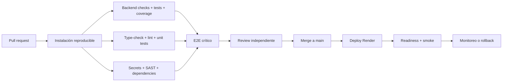

---

## 8. IA y herramientas de ingeniería

### 8.1 IA integrada en el producto

#### Selección efectiva de proveedor

1. Fake determinista cuando `AI_USE_FAKE_LLM=true`.
2. Clave BYO asociada al administrador.
3. `GEMINI_API_KEY` global del entorno.
4. Error si no existe proveedor utilizable.

Esta prioridad efectiva difiere del orden descrito en algunas secciones del README. El código de `ai_generation/client.py` es la fuente de verdad.

#### Controles

- Clave BYO cifrada en reposo.
- Clave no serializada al cliente ni disponible en rutas de empleado.
- Saneamiento de DNI, email, teléfono y algunos nombres etiquetados.
- Prompts construidos desde contenido de curso/documentos, no desde queryset de empleados.
- Respuesta tratada como borrador; persistencia mediante APIs normales tras revisión.
- Fake LLM para tests sin coste ni tráfico externo.

#### Riesgos

- El saneamiento regex no garantiza anonimización completa de texto libre.
- El administrador controla `base_url`; debe aplicarse allowlist o bloqueo de redes privadas.
- Las llamadas síncronas ocupan workers web.
- No hay tracking de tokens, coste, latencia o cuota.
- No hay evaluación automática de calidad o groundedness.
- El endpoint PDF IA lee el archivo completo y depende de `PyPDF2` no declarado.
- El guardado de contenido guiado no persiste todos los campos mostrados.

### 8.2 Herramientas/agentes usados en desarrollo

| Herramienta | Evidencia | Uso verificable |
|---|---|---|
| OpenSpec / SDD | `openspec/changes/archive/...` | Propuesta, specs, diseño, tareas, progreso, verificación y archivo del MVP. |
| Graphify | `graphify-out/`, `okf-bundle/` | Extracción de nodos, relaciones, comunidades y conocimiento navegable. |
| Registro de skills | `.atl/skill-registry.md` | Inventario generado de skills disponibles en varios asistentes. |
| GitHub CLI / Git | Historial y PRs | Branching, issues, PRs y merges. |
| Copilotos/agentes concretos | No hay configuración específica versionada | No se puede atribuir trabajo a Copilot, Cursor, Claude, Gemini, Codex u otro agente sin evidencia adicional. |

El registro enumera ecosistemas posibles, pero **no prueba cuáles se utilizaron**. La documentación evita inventar atribuciones.

### 8.3 Flujo de IA recomendado para ingeniería

1. El humano define objetivo, constraints y criterio de aceptación.
2. OpenSpec captura requisitos y escenarios antes del cambio grande.
3. El agente explora código y cita evidencia; no diseña desde supuestos.
4. La implementación se divide en unidades revisables, con tests junto al comportamiento.
5. Un revisor humano valida dominio, seguridad y migraciones.
6. CI ejecuta pruebas y análisis reproducibles.
7. Los resultados de agentes se consideran sugerencias, no aprobación.
8. Decisiones no obvias se guardan como ADR y se conectan con la feature.

### 8.4 Política mínima de uso responsable

- No enviar DNI, tokens, claves, expedientes o datos reales a asistentes externos.
- Usar datos sintéticos en prompts, tests y capturas.
- Revisar licencias y procedencia de código sugerido.
- No fusionar cambios generados sin tests y revisión humana.
- Registrar herramienta, alcance y validaciones cuando una entrega dependa materialmente de IA.
- Prohibir que un agente ejecute acciones destructivas o publique secretos sin confirmación.

---

## 9. Despliegue en Render

### 9.1 Infraestructura actual

| Recurso | Configuración versionada | Estado |
|---|---|---|
| Web Service | `onboarding-formation`, runtime Docker | Declarado. |
| Región | Frankfurt | Declarada. |
| Plan | Free | Declarado; sin garantía de capacidad/SLA. |
| Auto deploy | Cada commit | Activo. |
| PostgreSQL | Host externo por `POSTGRES_*` | Usado, pero no declarado como recurso Blueprint. |
| Background Worker | Ninguno | IA, email y certificados se ejecutan en request. |
| Cron Job | Ninguno | Retención y limpieza no se aplican automáticamente. |
| Redis/cache | Ninguno | Rate limit permanece por proceso. |
| Storage | S3 opcional; filesystem fallback | Requiere variables para persistencia fiable. |

### 9.2 Build de imagen

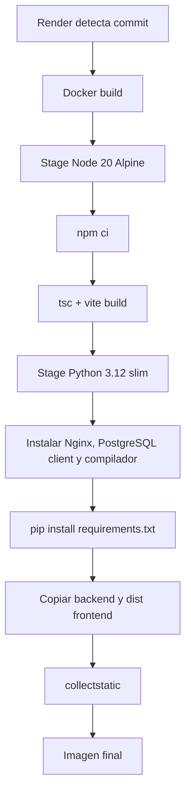

`collectstatic` está seguido por `|| true`, por lo que un fallo puede ocultarse durante el build. La imagen final se ejecuta como root y las dependencias Python no están fijadas en un lockfile.

### 9.3 Arranque actual

1. `start.sh` lee `PORT` con fallback 10000.
2. Ejecuta `python manage.py migrate --noinput`.
3. Ejecuta un script que crea `admin/admin1234` si no existe.
4. Renderiza la configuración Nginx con `envsubst`.
5. Arranca Gunicorn en background en `127.0.0.1:8001`.
6. Espera tres segundos fijos.
7. Arranca Nginx en foreground.

Este patrón no dispone de supervisor real. Si Gunicorn muere después del arranque, Nginx puede continuar vivo devolviendo errores. Las migraciones compiten si se escala a varias instancias.

### 9.4 Enrutamiento

| Ruta | Destino | Protección |
|---|---|---|
| `/` y rutas SPA | `index.html`/assets | Pública; la SPA protege vistas sensibles. |
| `/api/` | Gunicorn/Django | Middleware/vistas Django. |
| `/django-admin/` | Gunicorn/Django Admin | Sesión administrativa Django. |
| `/static/` | Archivos estáticos | Nginx/WhiteNoise según ruta. |
| `/media/` | No debe exponer PDFs de secciones | Entrega por API autenticada. |

En el bloque `/django-admin/`, `nginx.conf` asigna `X-Forwarded-Proto` dos veces; la segunda asignación usa `$scheme` y puede contradecir el protocolo reenviado por Render. El fix del PR #32 dejó correctamente preservado `/api/`, pero no eliminó esta inconsistencia del Admin.

### 9.5 Variables y secretos

#### Declaradas en `render.yaml`

| Variable | Tipo | Uso |
|---|---|---|
| `DJANGO_SECRET_KEY` | Secreto | Firma de sesión y seguridad Django. |
| `DJANGO_DEBUG` | Config | `False`. |
| `DJANGO_ALLOWED_HOSTS` | Config protegida | Hosts aceptados. |
| `FRONTEND_BASE_URL` | Config protegida | CORS/CSRF; actualmente no se exporta como setting reutilizable por plantillas. |
| `POSTGRES_HOST/PORT/DB/USER` | Config | Conexión PostgreSQL. |
| `POSTGRES_PASSWORD` | Secreto | Autenticación PostgreSQL. |
| `DNI_ENCRYPTION_KEY` | Secreto crítico | Cifrado DNI y credenciales protegidas. |
| `GEMINI_API_KEY` | Secreto | Proveedor global LLM. |
| `GEMINI_MODEL` | Config | Modelo configurado como `gemini-3.6-flash`. |
| `AI_USE_FAKE_LLM` | Config | `false` en Render. |
| `S3_STORAGE_BUCKET_NAME` | Config/secreto | Activa storage S3. |
| `S3_ENDPOINT_URL/REGION_NAME` | Config | Endpoint y región. |
| `S3_ACCESS_KEY_ID/SECRET_ACCESS_KEY` | Secretos | Acceso al bucket. |
| `EMAIL_TRANSPORT` | Config | `resend`. |
| `RESEND_API_KEY` | Secreto | Envío de email. |
| `DEFAULT_FROM_EMAIL` | Config | Remitente verificado. |

#### Soportadas, no declaradas en Blueprint

| Variable | Default | Riesgo |
|---|---|---|
| `CSRF_TRUSTED_ORIGINS` | Vacío | Puede ser necesaria en topologías separadas. |
| `EMPLOYEE_TOKEN_TTL_SECONDS` | 86400 | Debe responder a política de acceso. |
| `RETENTION_EMPLOYEE_DAYS` | 1825 | No existe job de aplicación. |
| `RETENTION_CERT_DAYS` | 1825 | No existe job de aplicación. |
| `PORT` | 10000 local | Render la inyecta. |

#### Estrategia requerida

- Secretos con `sync:false`, acceso de mínimo privilegio y rotación documentada.
- Separar claves por finalidad: Django, DNI, LLM, S3, correo y base de datos.
- Fallar el arranque en Render si faltan PostgreSQL o S3 requeridos.
- No imprimir cuerpo de emails con tokens en producción.
- Mantener una matriz de propietarios, caducidad y última rotación fuera del repositorio.

### 9.6 CI/CD actual

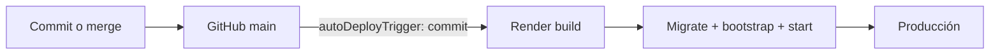

No existe una fase automatizada versionada entre GitHub y Render. No hay checks requeridos, protección de rama, rulesets ni review independiente observable.

### 9.7 CI/CD objetivo

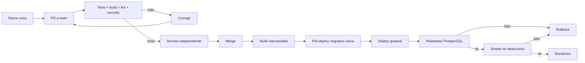

### 9.8 Monitoreo y observabilidad

#### Estado actual

- Gunicorn envía access/error logs a stdout.
- Nginx conserva logging convencional.
- Existen warnings puntuales en notificaciones y certificados.
- `/api/health/` devuelve una respuesta estática; no comprueba DB, S3, email o LLM.
- `AuditEvent` es observabilidad de negocio, no telemetría operativa.
- No hay Sentry, OpenTelemetry, Prometheus, métricas, trazas, dashboards o alertas versionados.

#### Objetivo de producción

| Señal | Instrumentación mínima | Alerta sugerida |
|---|---|---|
| Disponibilidad | Liveness y readiness separadas | 3 fallos consecutivos o 5xx sostenidos. |
| Aplicación | Excepciones agrupadas y logs JSON con request ID | Aumento de error rate y regresiones nuevas. |
| Rendimiento | p50/p95/p99 por endpoint | p95 fuera de SLO. |
| Workers | CPU, memoria, reinicios, backlog | Saturación o OOM. |
| PostgreSQL | Conexiones, latencia, almacenamiento, backups | Capacidad alta o backup fallido. |
| S3 | Errores/latencia de upload/download | Acceso denegado o error sostenido. |
| Resend | Entregas, rebotes, errores | Tasa de fallo sobre umbral. |
| LLM | Latencia, timeout, modelo, tokens/coste | Cuota, coste o errores anómalos. |
| Negocio | Importaciones, matrículas, aprobaciones | Caída brusca o estados bloqueados. |

Los logs deben excluir DNI, tokens, códigos, claves y texto sensible de documentos.

### 9.9 Escalado y resiliencia

| Dimensión | Límite actual | Requisito previo al escalado |
|---|---|---|
| Web | 2 workers x 2 threads | Medir carga, ajustar workers y readiness. |
| Horizontal | Migraciones en cada arranque | Migración única pre-deploy. |
| Sesión | Sesiones Django en DB | Validar capacidad y afinidad no necesaria. |
| Rate limit | Memoria por proceso | Redis o backend distribuido. |
| Archivos | Filesystem fallback | S3 obligatorio. |
| IA | Request síncrono | Cola/worker, timeouts, reintentos y límites. |
| Email | Envío síncrono | Cola y reintentos idempotentes si el volumen aumenta. |
| Retención | Sin cron | Job programado auditable. |
| Base de datos | Sin pool explícito | Presupuesto de conexiones y pooling. |

### 9.10 Runbook objetivo de despliegue

> **Objetivo pendiente:** este procedimiento presupone CI, readiness y rollback operativo que todavía no están implantados por completo.

1. Confirmar CI verde y revisión aprobada.
2. Confirmar backup reciente y restauración probada para migraciones de riesgo.
3. Validar variables obligatorias y región de servicios.
4. Ejecutar migraciones una sola vez.
5. Desplegar sin crear usuarios ni datos de prueba.
6. Esperar liveness y readiness de PostgreSQL.
7. Ejecutar smoke de login, status y consulta no destructiva.
8. Observar 5xx, latencia y reinicios durante la ventana acordada.
9. Ante fallo, redeploy del artefacto previo y aplicar estrategia de migración compatible.
10. Registrar commit, imagen, migraciones, operador, hora y resultado.

---

## 10. Historial de ramas y pull requests

### 10.1 Modelo de branching observado

El repositorio no usa GitFlow: no existen `develop` o `release/*`. Tampoco es trunk-based puro porque se emplearon cadenas largas de ramas apiladas.

El modelo real es **mainline con ramas cortas y stacked PRs**:

1. `main` actúa como tronco de integración y producción.
2. Features/fixes usan `feat/*`, `fix/*` y ramas históricas `mvp/*`.
3. Los merges conservan topología mediante merge commits.
4. Cambios grandes se dividen en cadenas base-head.
5. Una rama tracker integra la cadena y después se fusiona en `main`.
6. También existen commits directos relevantes fuera de PR.

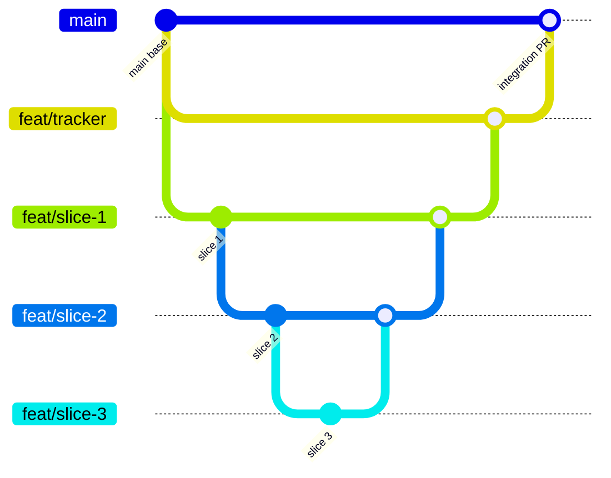

### 10.2 Gobierno de PR observado

| Control | Evidencia |
|---|---|
| PRs fusionados | 27 PR reales recuperados mediante GitHub CLI. |
| Reviews | Ninguna review registrada. |
| `reviewDecision` | Vacío en todos. |
| Checks CI | `statusCheckRollup` vacío. |
| Protección de `main` | No observada. |
| Issues aprobados | Ocho issues cerrados con `status:approved`. |
| Aprobación efectiva | Fusión por el mismo usuario autor. |
| Evidencia técnica | Comandos y checklists declarados en cuerpos, no checks automatizados. |

Por tanto, los criterios de aprobación documentados son **declaraciones históricas**, no evidencia independiente reproducible.

### 10.3 PRs del MVP inicial

| PR | Título | Head → Base | Cambio principal | Criterio/evidencia disponible |
|---|---|---|---|---|
| #1 | `Mvp/pr2 auth import` | `mvp/pr2-auth-import` → `main` | Autenticación e importación acumuladas | Sin cuerpo, reviews o checks. |
| #2 | `Mvp/pr3 courses enroll ai` | `mvp/pr3-courses-enroll-ai` → `main` | Cursos, matrículas e IA | Sin cuerpo, reviews o checks. |
| #3 | `Mvp/pr4 reading test` | `mvp/pr4-reading-test` → `main` | Lectura y test | Sin cuerpo, reviews o checks. |
| #4 | `Mvp/pr5 secure cert badges expediente` | `mvp/pr5-secure-cert-badges-expediente` → `main` | Acceso, certificados, badges y expediente | Sin cuerpo, reviews o checks. |
| #5 | `Mvp/pr1 scaffold models` | `mvp/pr1-scaffold-models` → `main` | Remanente de scaffold/modelos | Sin cuerpo, reviews o checks. |

Los PR #1-#4 contenían diffs acumulativos contra `main`; el “PR1” conceptual terminó abriéndose como GitHub #5. Los “PR6” y “PR7” de los documentos SDD fueron unidades de trabajo, no PRs GitHub independientes. La corrección DNI `mvp/fix-w1-dni-crypto` llegó a `main` mediante merge directo `3b145d2`.

### 10.4 Correcciones independientes

| PR | Título | Rama | Cambios | Criterio declarado |
|---|---|---|---:|---|
| #7 | `fix(dashboard): count employees from Employee table instead of Expediente` | `fix/dashboard-employee-count` → `main` | +49/-2 | Issue #6 aprobado; checklist manual. |
| #9 | `fix(ai): validate Gemini BYO configuration` | `fix/gemini-byo-validation` → `main` | +150/-24 | Issue #8; declara 10 tests y build. |
| #11 | `fix(ai): prefill Gemini BYO form values` | `fix/prefill-gemini-byo-form` → `main` | +6/-0 | Issue #10; declara build/type-check. |
| #13 | `fix(ui): forward refs to native inputs` | `fix/forward-input-ref` → `main` | +9/-11 | Issue #12; declara build/type-check. |
| #30 | `fix(security): force debug off on Render` | `fix/secure-debug-default` → `main` | +3/-1 | Issue #29; checks backend declarados. |
| #32 | `fix(nginx): preserve forwarded HTTPS protocol` | `fix/preserve-forwarded-proto` → `main` | +7/-1 | Issue #31; sintaxis manual; Render pendiente y duplicidad aún presente en `/django-admin/`. |

### 10.5 Cadena de ciclo formativo #15-#28

El issue #14 definió un cambio superior al presupuesto de revisión. La cadena real fue:

```text
feat/course-lifecycle-management
└── feat/course-versioning                         #15
    └── feat/course-management-api                 #16
        └── feat/training-assignments              #17
            └── feat/training-management-api       #18
                └── feat/employee-position-management #19
                    └── feat/private-section-pdfs  #20
                        └── feat/employee-course-reader-api #21
                            └── feat/course-editor-ui #22
                                └── feat/assignment-management-ui #23
                                    └── feat/active-reading-component #24
                                        └── feat/employee-portal-integration #25
                                            └── fix/course-lifecycle-hardening #26
                                                └── feat/comprehension-test-ui #27
```

| PR | Título real | Aporte funcional | Evidencia declarada |
|---|---|---|---|
| #15 | `feat(courses): add versioned training history models` | Modelos de versión, ciclos y migración | 33 tests y migraciones sin drift. |
| #16 | `feat(courses): add version lifecycle APIs` | Clonado, publicación, edición y archivo | 6 tests de cursos. |
| #17 | `feat(training): add assignment and enrollment lifecycle services` | Asignaciones, pausa, cancelación y repetición | 30 tests de `reading_gate`. |
| #18 | `feat(training): expose assignment lifecycle APIs` | Endpoints administrativos | 3 tests focalizados. |
| #19 | `feat(employees): add individual and bulk position management` | Puestos individuales/masivos | 9 tests de empleados. |
| #20 | `feat(courses): add private section PDF storage` | PDF privado y S3 | 8 tests y Django check. |
| #21 | `feat(employee): expose versioned course reader API` | API del lector fijada a versión | 6 tests de autorización. |
| #22 | `feat(admin): edit versioned course sections and PDFs` | Editor administrativo | Build frontend. |
| #23 | `feat(admin): manage assignments and employee positions` | UI de asignación/puestos/ciclos | Build frontend. |
| #24 | `feat(employee): track active section reading time` | Heartbeats y actividad | Build frontend. |
| #25 | `feat(employee): connect portal to assigned course versions` | Portal conectado a matrículas reales | Build frontend. |
| #26 | `fix(training): enforce version and reader security boundaries` | Ownership, CSRF, PDF y notificaciones | 53 tests backend y build. |
| #27 | `feat(employee): complete comprehension test flow` | UI completa de preguntas y reintento | 12 tests focalizados y build. |
| #28 | `feat(training): add versioned course and assignment lifecycle` | Tracker → `main`, integración completa | Declara 74 tests, checks, build y revisión adversarial. |

La integración se hizo de la punta hacia la raíz: `#27 → #26 → ... → #15 → #28`. Por ello, las estadísticas finales de GitHub de PRs bajos en la cadena incluyen cambios acumulados y no representan el tamaño aislado del slice.

### 10.6 Cadena de acceso masivo #34-#35

| PR | Título | Head → Base | Aporte | Evidencia declarada |
|---|---|---|---|---|
| #35 | `feat(admin): generate and copy employee access codes` | UI → rama API | Interfaz para generar/copiar códigos | Build frontend. |
| #34 | `feat(access): generate employee codes in bulk` | API → `main` | API, servicio y UI acumulada | 11 tests de notificaciones; suite de 78 tests declarada. |

Primero #35 se fusionó dentro de #34; después #34 llegó a `main` con API y UI.

### 10.7 Hitos de commits

| Hash corto | Hito |
|---|---|
| `bb8bdc48` | Primer commit. |
| `25b313e9` | Scaffold y modelos conceptuales del MVP. |
| `e7e99925` | Auth e importación. |
| `5fa784e6` | Cursos, enrollment e IA. |
| `2ba8a08d` | Lectura y test. |
| `2c39addf` | Acceso, certificados, badges y expediente. |
| `fb09be5a` | Auditoría y QA. |
| `fb51ebd6` | Corrección criptográfica W1 y archivo documental. |
| `3b145d2e` | Integración acumulada del MVP en `main`. |
| `c8ba651e` | Integración de ciclo versionado, PR #28. |
| `b7bef44c` | Integración de acceso masivo, PR #34. |
| `8dad3c50` | HEAD del corte; guía Scribe en README. |

### 10.8 Política de branching objetivo

- Mantener `main` desplegable y protegida.
- Crear issue/spec aprobada antes de cambios amplios.
- Usar ramas cortas `feat/<outcome>` o `fix/<problem>`.
- Requerir CI y una review independiente.
- Dividir PRs grandes por comportamiento completo, no por tipo de archivo.
- En stacked PRs, indicar base, predecesor, sucesor y orden de review.
- Mantener tests y documentación en la misma unidad de trabajo.
- Usar Conventional Commits y eliminar ramas fusionadas cuando no aporten valor histórico.
- No mezclar una etiqueta de aprobación del issue con aprobación técnica del PR.

---

## 11. Riesgos, deuda y evolución

### 11.1 Registro priorizado

| ID | Prioridad | Riesgo/deuda | Impacto | Acción recomendada |
|---|---|---|---|---|
| R-01 | P0 | Superusuario `admin/admin1234` en arranque | Compromiso total de una instalación nueva | Eliminar bootstrap fijo, rotar credenciales y usar comando explícito seguro. |
| R-02 | P0 | Tokens/credenciales de prueba versionados | Exposición y reutilización potencial | Invalidar/rotar, retirar fixtures sensibles y activar secret scanning. |
| R-03 | P1 | Magic link apunta a ruta inexistente | Empleado no puede entrar desde email | Unificar `FRONTEND_BASE_URL`, ruta y auto-redeem; añadir E2E. |
| R-04 | P1 | Autorización fail-open | Nueva API puede quedar pública | Denegar por defecto y declarar permisos por endpoint. |
| R-05 | P1 | Tercer intento no produce estado terminal | Matrícula bloqueada sin expediente final | Corregir transición de forma atómica y probar exactamente tres fallos. |
| R-06 | P1 | Dashboard/expediente usan estados obsoletos | Métricas y filtros incorrectos | Compartir contrato de estados y tests de presentación. |
| R-07 | P1 | Certificado usa datos del curso actual | Evidencia histórica inconsistente | Generar solo desde `course_version`/snapshot. |
| R-08 | P1 | Sin CI antes de auto-deploy | Regresiones directas a producción | Crear pipeline y condicionar Render a checks. |
| R-09 | P1 | Sin readiness/alertas | Fallos silenciosos o 503 prolongados | Health dependiente de DB y alertas externas. |
| R-10 | P2 | Rate limit local y proxy incorrecto | Bloqueo común o bypass con workers | Backend compartido y resolución segura de IP. |
| R-11 | P2 | Guardado IA descarta contenido | Pérdida funcional del borrador revisado | Corregir mapping y añadir test de persistencia. |
| R-12 | P2 | `PyPDF2` no declarado | Endpoint PDF IA falla en producción | Declarar/fijar dependencia y test de imagen limpia. |
| R-13 | P2 | Auditoría borrable por cascada | Pérdida de evidencia | `PROTECT`, WORM/trigger o política de archivado. |
| R-14 | P2 | Retención solo declarativa | Incumplimiento de política | Cron/worker de borrado o anonimización con legal hold. |
| R-15 | P2 | Migraciones en cada arranque | Carrera al escalar | Pre-deploy único y migraciones backward-compatible. |
| R-16 | P2 | IA/email síncronos | Saturación de workers | Cola y workers al crecer volumen. |
| R-17 | P2 | SSRF en LLM BYO | Acceso a servicios internos | Allowlist, validación DNS/IP y egress control. |
| R-18 | P3 | OpenSpec/Graphify obsoletos | Decisiones y grafo incompletos | Regenerar desde HEAD y añadir specs posteriores. |

### 11.2 Roadmap técnico recomendado

#### Fase 0. Contención de producción

- Eliminar credenciales fijas y rotar secretos comprometidos.
- Corregir magic link, tercer intento y certificado versionado.
- Diagnosticar disponibilidad real de Render.
- Añadir CI mínimo: backend, build frontend, migraciones y secret scanning.

#### Fase 1. Integridad y contratos

- Centralizar estados de matrícula en contrato compartido.
- Denegar API por defecto y probar todas las fronteras.
- Hacer canje atómico y fortalecer código manual.
- Añadir schemas OpenAPI o contratos equivalentes.
- Corregir E2E para exigir una matrícula y completar certificado/auditoría.

#### Fase 2. Operación fiable

- Separar migración del arranque web.
- Implementar readiness, logging estructurado y alertas.
- Hacer obligatorio PostgreSQL/S3 en producción.
- Establecer backups, restore drills, RPO/RTO y rollback.
- Aplicar retención mediante trabajo programado auditable.

#### Fase 3. Escala y evolución

- Cola para email, IA y generación pesada.
- Rate limit/caché compartidos.
- Métricas de negocio y capacidad.
- Evaluar SSO/MFA y firma de certificados según requisitos.
- Diseñar tenancy solo si el modelo de negocio lo exige.

---

## 12. Anexos de trazabilidad

### 12.1 Inventario de aplicaciones y rutas

| Área | Prefijo/API | Implementación |
|---|---|---|
| Salud | `/api/health/` | `backend/mvp_project/urls.py` |
| Auth | `/api/auth/...` | `backend/authentication/urls.py` |
| Importación/empleados | `/api/import`, `/api/employees/...` | `backend/employees/urls.py` |
| Cursos/versiones | `/api/courses/...`, `/api/course-versions/...` | `backend/courses/urls.py` |
| Asignaciones | `/api/admin/assignments/...` | `backend/reading_gate/urls.py` |
| Accesos masivos | `/api/admin/access-codes/batch` | `backend/notifications/urls.py` |
| Portal empleado | `/api/employee/enrollments...` | `backend/reading_gate/urls.py` |
| Lectura | `/api/reading/heartbeat` | `backend/reading_gate/urls.py` |
| Test | `/api/test/questions`, `/api/test/submit` | `backend/reading_gate/urls.py` |
| Expediente/auditoría | `/api/expediente`, `/api/audit` | `backend/reading_gate/urls.py` |
| Certificado | `/api/certificate/<enrollment>` | `backend/certificates/urls.py` |
| IA | `/api/ai/...` | `backend/ai_generation/urls.py` |

### 12.2 Eventos de auditoría relevantes

| Evento | Disparador | Evidencia asociada |
|---|---|---|
| `import` | Alta/importación de empleado | Resultado de importación sin token en payload. |
| `enrollment_assigned` | Creación de matrícula | Curso, versión/ciclo y actor. |
| `section_unlock` | Sección habilitada | Matrícula, sección, dispositivo/sesión. |
| `section_complete` | Tiempo mínimo alcanzado | Progreso acumulado. |
| `reading_complete` | Todas las secciones completadas | Transición a `complete`. |
| `attempt_start` | Obtención del subset | Número de intento. |
| `attempt_submit` | Envío de respuestas | Resultado agregado, no respuestas correctas expuestas. |
| `attempt_fail` | Puntuación insuficiente | Reinicio y contador. |
| `attempt_blocked` | Intentos no disponibles | Motivo de bloqueo. |
| `certificate_issued` | Generación/descarga | Matrícula y momento. |

### 12.3 Glosario

| Término | Definición |
|---|---|
| Curso | Identidad estable de una formación. |
| Versión de curso | Snapshot draft/publicado/archivado de secciones y evaluación. |
| Matrícula (`Enrollment`) | Realización de un curso por un empleado en un ciclo concreto. |
| Ciclo | Número de repetición que preserva matrículas anteriores. |
| Lectura acreditada | Tiempo aceptado por backend a partir de actividad/visibilidad. |
| Expediente | Resultado consolidado de una matrícula. |
| Certificado | PDF interno imprimible para una matrícula aprobada. |
| Auditoría append-only | Registros no editables por API/admin; no implica WORM en base. |
| Magic link | URL temporal que contiene un token de un solo uso. |
| BYO key | Credencial LLM aportada por el administrador. |
| Human-in-the-loop | Flujo en el que IA propone y una persona revisa/persiste. |
| Readiness | Capacidad real de atender tráfico, incluida dependencia de DB. |
| SLO | Objetivo medible de nivel de servicio. |

### 12.4 Fuentes principales

| Fuente | Uso |
|---|---|
| `README.md` | Visión, ejecución local, seguridad y supuestos de cumplimiento. |
| `backend/mvp_project/settings.py` | Configuración efectiva de seguridad, datos e integraciones. |
| `backend/*/models.py` | Entidades, cardinalidades y constraints. |
| `backend/*/services.py` | Reglas de dominio y orquestación. |
| `backend/*/views.py` | Contratos, autorización y respuestas. |
| `frontend/src/App.tsx` | Rutas raíz. |
| `frontend/src/admin/` | Casos de uso administrativos. |
| `frontend/src/employee/` | Portal, lectura y evaluación. |
| `frontend/src/components/PdfReader/` | Heartbeats y tiempo activo. |
| `render.yaml`, `Dockerfile`, `start.sh`, `nginx.conf` | Topología de producción. |
| `openspec/specs/` | Requisitos formalizados del MVP. |
| `openspec/changes/archive/...` | Diseño, tareas y verificación histórica. |
| `graphify-out/`, `okf-bundle/` | Grafo histórico y conocimiento generado. |
| Git y GitHub PRs | Evolución, ramas, merges y evidencia declarada. |

### 12.5 Preguntas pendientes de decisión

1. ¿El umbral de aprobación debe permanecer en 100 %?
2. ¿Qué estado exacto y expediente corresponde al tercer fallo?
3. ¿Qué nivel de identidad exige el valor legal/operativo esperado?
4. ¿Quién puede consultar DNI, certificados y auditoría?
5. ¿Cuál es la política efectiva de retención, anonimización y legal hold?
6. ¿Qué RPO, RTO y SLO necesita producción?
7. ¿Se ratifica el monolito Docker o se vuelve a unidades separadas?
8. ¿Gemini global forma parte del producto o solo se admite BYO?
9. ¿Qué proveedores/regiones LLM y email están aprobados?
10. ¿Qué requisitos jurídicos debe cumplir el certificado?
11. ¿Cuándo se justifica multi-tenancy y con qué modelo de aislamiento?
12. ¿Qué volumen máximo de empleados, cursos y heartbeats debe soportarse?

### 12.6 Criterio de mantenimiento de este documento

Actualizar este documento cuando ocurra cualquiera de estos cambios:

- Nueva feature, entidad o estado de dominio.
- Cambio de autenticación, cifrado, retención o autorización.
- Nueva integración externa o variable obligatoria.
- Cambio de topología, proveedor, región o pipeline.
- Decisión ADR aceptada, sustituida o retirada.
- Corrección de un riesgo P0/P1.
- Nueva cadena de PRs que altere arquitectura o flujo crítico.
- Regeneración de OpenSpec/Graphify o nueva verificación integral.

Toda actualización debe indicar commit de corte, evidencia de pruebas y si describe estado actual u objetivo.
